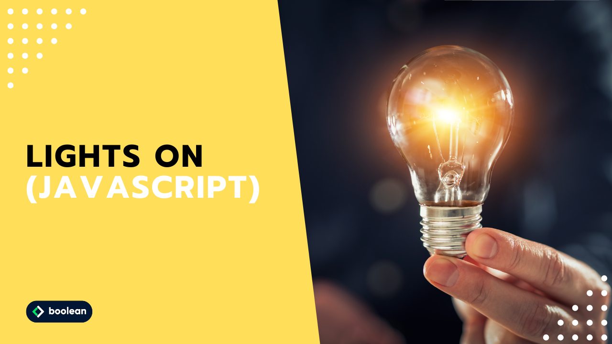

 
Ventitreesimo Esercizio Classe #137 - Boolean

---

Studente: Fabio Ferrero

---
# English

## Target of the project:
- Let's insert the image of the unlit bulb on the page, which you can find in the attachment, and next to it a button that says “Turn on.”
- When the button is clicked, the bulb should turn on (so we will have to use the image of the light bulb turned on, also attached)

**BONUS**
Let's do on and off:
- On the first click the bulb turns on and “Turn off” appears in the button.
- On the second click the bulb turns off and in the button appears the words “Turn on”
- And so on...

---
# Italiano

## Obiettivo del progetto:
- Inseriamo in pagina l’immagine della lampadina spenta che trovate in allegato e accanto un bottone con la scritta “Accendi”.
- Al click del bottone, la lampadina dovrà accendersi (dovremo quindi utilizzare l’immagine della lampadina accesa, sempre in allegato)

**BONUS**
Facciamo accendi e spegni:
- Al primo click la lampadina si accende e nel bottone compare la scritta “Spegni”
- Al secondo click la lampadina si spegne e nel bottone compare la scritta “Accendi”
- E così via...
---

